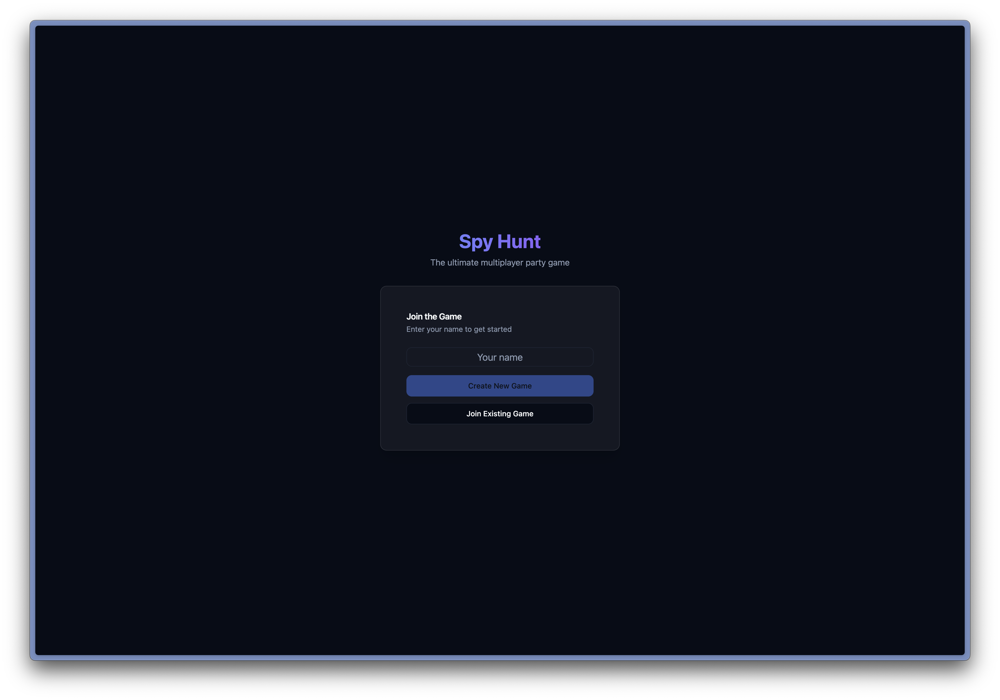
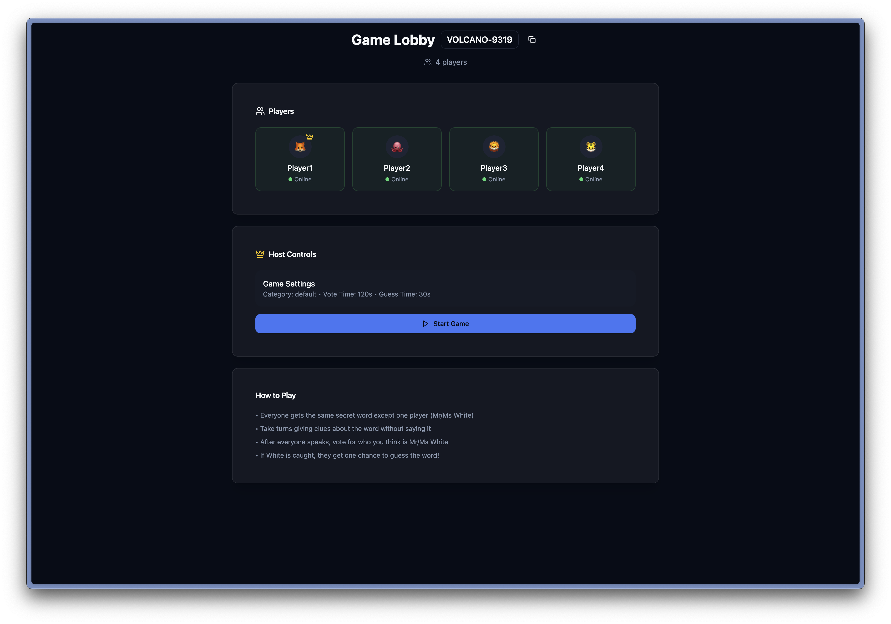
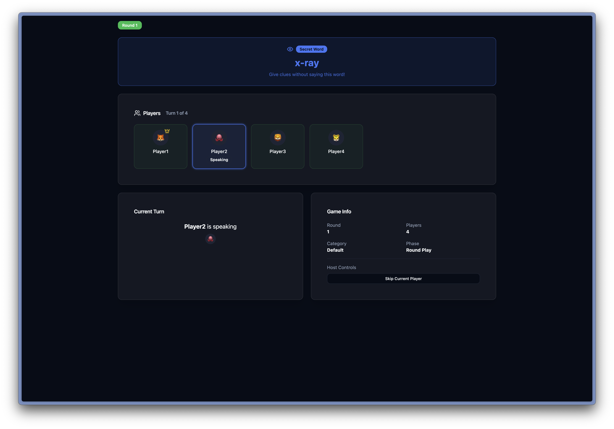
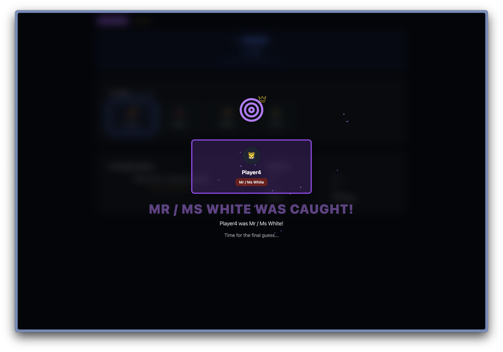

## Spy Hunt — Find Mr / Ms White

Welcome to Spy Hunt, a fast, social, and slightly chaotic party game for browsers. One player is Mr / Ms White and doesn’t know the secret word. Everyone else does. Can you talk your way out of trouble—or sniff out the imposter before they guess the word and steal the win?

### Why you’ll love it
- **Quick to learn**: 2 minutes and you’re playing.
- **Fast rounds**: talk, vote, dramatic full‑screen reveals, repeat.
- **Big‑screen friendly**: animations and layouts tuned for shared screens.
- **Zero installs**: open a link and play on phones, tablets, laptops.

## How the game works
1. **Deal**: Everyone gets the same secret word—except Mr / Ms White.
2. **Clues**: Players take turns saying short, clever clues without revealing the word.
3. **Vote**: After speaking, everyone votes for who they think is Mr / Ms White.
4. **Caught?**
   - If Mr / Ms White is voted out, they get one last chance to guess the secret word.
   - If they guess right, they win. If not, the rest win.
5. **Not caught?** Eliminate an innocent, and the game continues.

## Screens you’ll see
- **Lobby**: share a fancy session code, see who’s online, host starts the game.
- **Round Play**: turn order and timers keep the pace tight.
- **Voting**: clean, tap‑friendly vote UI and skip vote option.
- **Cinematic reveals**: full‑screen elimination and “Mr / Ms White was caught!” animations.
- **Results**: winner banner, secret word reveal, standings, and White’s guess.

### Start screen

Enter your name and either create a new game or join an existing session with the code.

### Lobby

See who’s in, copy the session code, and the host can start the game once enough players have joined.

### Gameplay round

Players speak in turn, offering subtle clues about the secret word. Watch the timer and get ready to vote.

### Elimination animation

The full‑screen reveal when someone is voted out—featuring the dramatic “Mr / Ms White was caught!” moment.

## Tech stack
- **Frontend**: React + Vite, Zustand, Tailwind, Radix UI, Lucide icons, Socket.IO client
- **Backend**: Fastify + Socket.IO, TypeScript, Zod
- **Runtime**: Dockerized services; Nginx serves the SPA and proxies WebSocket/API

## Quickstart (local development)
Prereqs: Node 20+, pnpm 9+, Docker (optional), macOS/Linux/Windows.

### Start backend
```bash
pnpm --dir backend install
pnpm --dir backend run dev
# Defaults to PORT=8080 (change via env):
# PORT=8082 pnpm --dir backend run dev
```

### Start frontend (Vite)
```bash
pnpm --dir frontend install
pnpm --dir frontend run dev
# If backend runs on a non-default port, start Vite like:
# VITE_API_URL=http://localhost:8082/api \
# VITE_SOCKET_URL=http://localhost:8082 \
# pnpm --dir frontend run dev
```

Open the app at `http://localhost:5173`.

## Run with Docker Compose (local or Portainer)
This repo includes a ready-to-run stack: `frontend` (Nginx + SPA) and `backend` (Fastify + Socket.IO). The services communicate over a shared external network.

### 1) Create the external network once
```bash
docker network create shared-bridge
```

### 2) Configure allowed origins (CORS)
Edit `docker-compose.yml` and set backend `ALLOWED_ORIGINS` to your public URL(s), comma-separated.
```yaml
environment:
  - ALLOWED_ORIGINS=https://your-domain.example
```

### 3) Start the stack
```bash
docker compose up -d
```

- Frontend: `http://localhost:8081`
- Backend health: `http://localhost:8080/health`

### Notes for Portainer
- Create a network named `shared-bridge` in Portainer (or via CLI).
- Deploy the stack from this repo’s `docker-compose.yml`.
- If you use a reverse proxy (Traefik / Nginx) in your cluster, you can remove the `ports` section and route:
  - `https://your-domain` → service `frontend:80`
  - Frontend internally proxies `/api` and `/socket.io` to service `backend:8080`.

## Build and push images to Docker Hub (amd64)
The commands below build only for `linux/amd64` (useful on Apple Silicon).

```bash
# Set your Docker Hub username and a tag
export DOCKERHUB_USER=your_dockerhub_username
export TAG=$(date +%Y%m%d-%H%M)

# Login
docker login

# Create and use a builder that supports cross-build
docker buildx create --name spybuilder --driver docker-container --bootstrap --use

# Backend
docker buildx build \
  --platform linux/amd64 \
  -t ${DOCKERHUB_USER}/spy-game-backend:latest \
  -t ${DOCKERHUB_USER}/spy-game-backend:${TAG} \
  -f backend/Dockerfile ./backend \
  --push

# Frontend
docker buildx build \
  --platform linux/amd64 \
  -t ${DOCKERHUB_USER}/spy-game-frontend:latest \
  -t ${DOCKERHUB_USER}/spy-game-frontend:${TAG} \
  -f frontend/Dockerfile ./frontend \
  --push
```

Update `docker-compose.yml` to pull from Docker Hub if you prefer images over local builds:
```yaml
image: your_dockerhub_username/spy-game-backend:latest
image: your_dockerhub_username/spy-game-frontend:latest
```

## Configuration reference
- **Backend env**
  - `PORT` (default `8080`)
  - `HOST` (default `0.0.0.0`)
  - `ALLOWED_ORIGINS` — comma-separated list of allowed origins for CORS
- **Frontend**
  - No runtime envs required in containers. The SPA uses relative paths (`/api`, `/socket.io`) and Nginx proxies to the backend service.
  - For local Vite dev, you may set `VITE_API_URL` and `VITE_SOCKET_URL` as shown above.

## Tips for great rounds
- Good clues are specific but non‑obvious.
- If you’re Mr / Ms White, echo others’ vibes without getting caught.
- If you’re not White, leave breadcrumbs that help your team—but not the imposter.

Have fun, and may your suspicions be correct just a little too often.